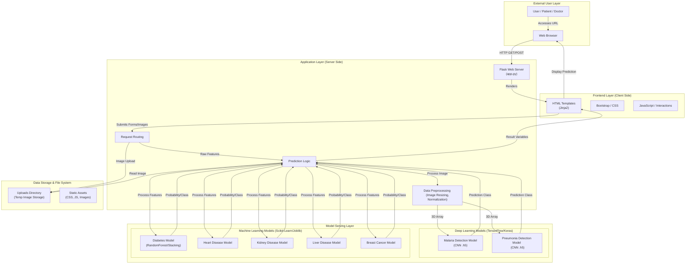

# Healthcare AI Prediction Platform - Architecture

## System Overview
The Healthcare AI Prediction Platform is a full-stack web application designed to predict various diseases using Machine Learning (ML) and Deep Learning (DL) models. The system allows users to input medical data (images or structured features) and receive real-time health assessments.

## Detailed Component Flow

### 1. User Interface (Frontend)
*   **Technologies**: HTML5, CSS3 (Bootstrap), Jinja2 Templating.
*   **Entry Points**:
    *   **Home Page**: Landing page with navigation.
    *   **Disease Forms**: Structured forms for Diabetes, Heart, Kidney, Liver, Cancer.
    *   **Image Uploaders**: Drag-and-drop or file selection for Malaria and Pneumonia.

### 2. Web Server (Backend)
*   **Core**: Python Flask (`app.py`).
*   **Server**: Gunicorn (Production) / Werkzeug (Dev).
*   **Responsibilities**:
    *   Handling HTTP Requests.
    *   Input Validation (Basic).
    *   File Management (Saving uploaded images to `uploads/`).
    *   Orchestrating Model Calls.

### 3. Data Processing Pipeline
*   **Image Data**:
    *   **Malaria**: Resized to 50x50x3 -> Normalized (1/255.0).
    *   **Pneumonia**: Resized to 64x64x3 -> Normalized (1/255.0).
*   **Structured Data**:
    *   Converted to List -> Numpy Array -> Reshape (1, -1).
    *   *Note: Currently lacks explicit scaling (StandardScaler) in `app.py`, limiting accuracy if models expect scaled data.*

### 4. Model Inventory
| Disease | Type | Input Format | Model File | Framework |
| :--- | :--- | :--- | :--- | :--- |
| **Malaria** | Image Classification | Image (50x50) | `model111.h5` | TensorFlow/Keras |
| **Pneumonia** | Image Classification | Image (64x64) | `my_model.h5` | TensorFlow/Keras |
| **Diabetes** | Binary Classification | 8 Features | `model1` | Scikit-Learn (Joblib) |
| **Heart** | Binary Classification | 13 Features | `model2` | Scikit-Learn (Joblib) |
| **Kidney** | Binary Classification | 12 Features | `model3` | Scikit-Learn (Joblib) |
| **Liver** | Binary Classification | 10 Features | `model4` | Scikit-Learn (Joblib) |
| **Cancer** | Binary Classification | 30 Features | `model` | Scikit-Learn (Joblib) |

## Deployment Strategy
*   **Platform**: cloud (e.g., Render, Heroku) or Local.
*   **Process**: `Procfile` defines `gunicorn app:app` as the entry command.
*   **Dependencies**: Defined in `requirements.txt` (TensorFlow, Flask, Scikit-learn, Numpy).
